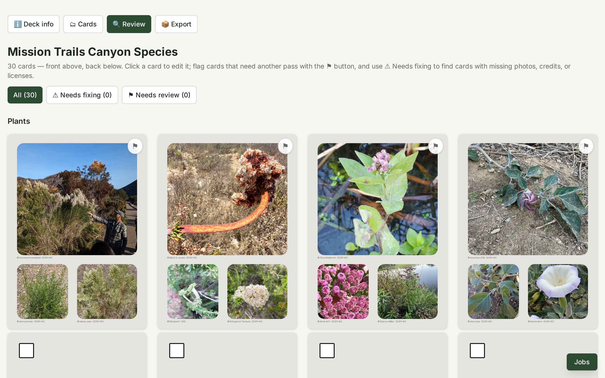
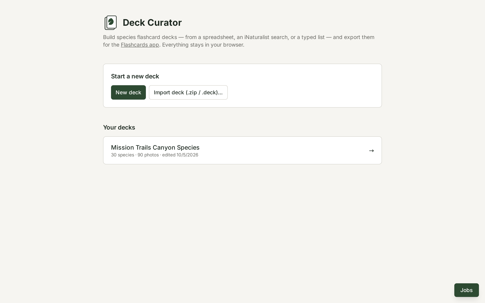
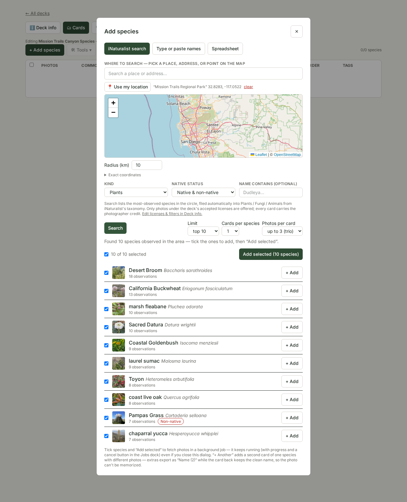
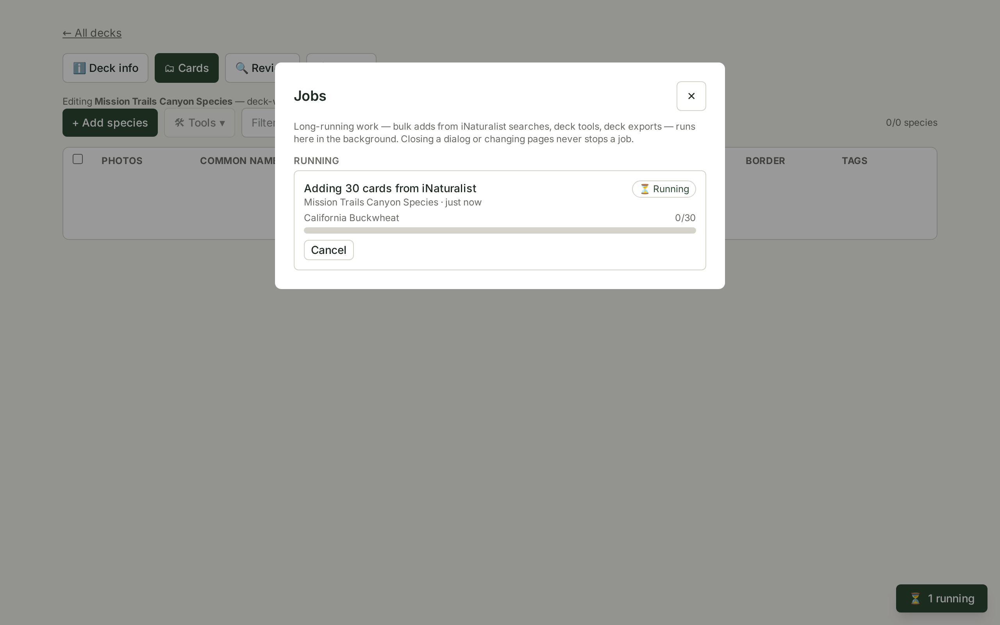
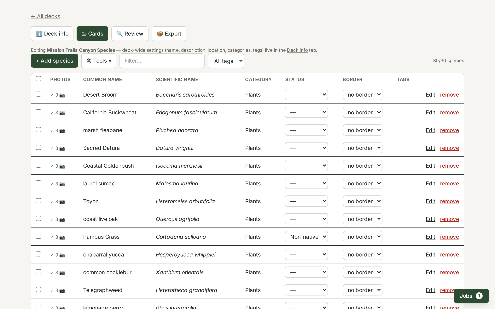
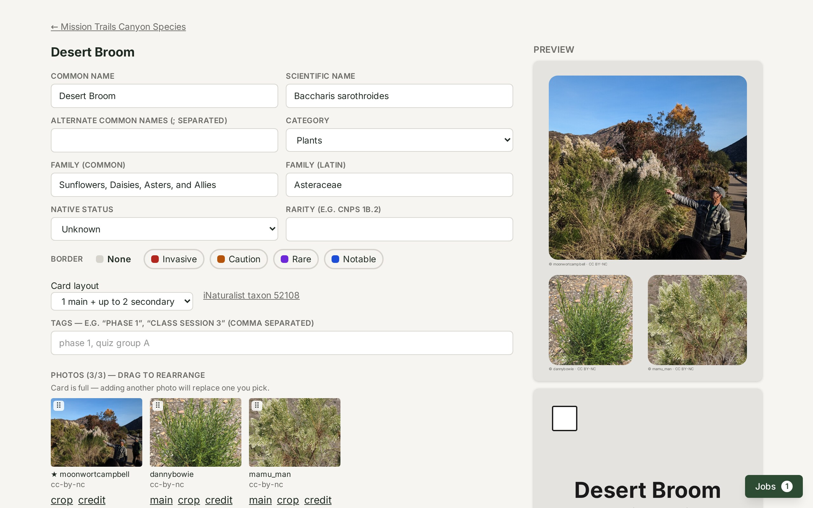
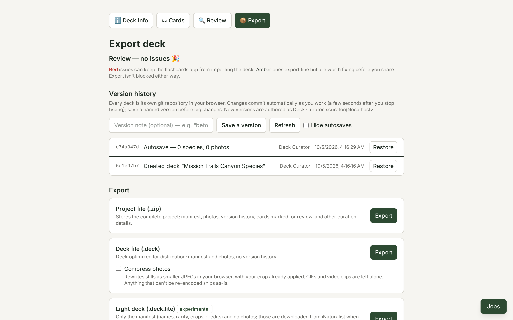

<div align="center">


# Deck Curator

**Build, curate, and share species flashcard decks — from an iNaturalist search, a spreadsheet, or a typed list — entirely in your browser.**

[Study the finished decks in the Flashcards app](https://cards.unimpossy.com) · [Read the deck format docs](docs/DECK_FORMAT.md) · [Report an issue](https://github.com/StickyNeutrino/deck-curator/issues)

[](LICENSE)
[](https://nodejs.org)
[](https://react.dev)
[](#privacy)



</div>

Deck Curator is a **free, open-source, client-side web app** for curating species flashcard decks — plant identification walks, nature journaling classes, citizen-science workshops, park interpretive programs. Search **[iNaturalist](https://www.inaturalist.org)** for the most-observed species in any place on Earth, pull in **Creative Commons–licensed photos** with automatic photographer credits, tune every card, and export a deck for the [Flashcards app](https://cards.unimpossy.com) — or a full project backup, version history included.

**Everything runs in your browser.** Your species lists, photos, and API responses never touch a server: no accounts, no uploads, no analytics. Each deck is even its own **git repository living in your browser** (real git objects, committed automatically as you work), so every change is versioned and restorable.

Deck Curator grew out of the **Healthy Canyons** project in San Diego, whose canyon plant deck ships as a built-in in the Flashcards app.

## Contents

[Features](#features) · [How it works](#how-it-works) · [Card layouts](#card-layouts) · [The deck format](#the-deck-format) · [Privacy](#privacy) · [Getting started](#getting-started) · [Tech stack](#tech-stack) · [FAQ](#faq) · [Contributing](#contributing) · [License](#license)

## Features

| | |
|---|---|
| 🔎 **iNaturalist search** | List the most-observed species in any place — geocoded by name, picked on a map, or entered as coordinates — filtered by kind (plants, birds, insects…), native vs. non-native, or name. Results come with thumbnails and one-click add. |
| 🖼️ **Licensed photos, auto-credited** | Every photo is Creative Commons (CC0, CC-BY, CC-BY-SA, CC-BY-NC, CC-BY-NC-SA — never ND or all-rights-reserved) and carries its observer + license credit, exported with the deck. |
| 🧪 **Deck tools** | Batch-fill missing names, families, native status, conservation status, and photos from iNaturalist's taxonomy and place checklists — over the whole deck or a selection. |
| ⏳ **Background jobs** | Bulk adds, tool runs, and exports keep running while you close dialogs or switch pages, with live progress, cancellation, and a re-download for finished exports. |
| 🕘 **Git version history** | Every deck is its own git repository inside your browser. Changes auto-commit; restore any version from the export page. |
| ✅ **Review workflow** | Flag cards that need another pass, filter down to them, and jump straight into editing. A validation report catches duplicate names and missing photos, licenses, or credits before export. |
| 🏷️ **Tags & filtering** | Label cards with your own tags (phases, class sessions, units) and filter the deck by them. |
| 📤 **Three export formats** | A full project file (`.zip`, with history), a distributable deck file (`.deck`), and an experimental light deck (`.deck.lite`, photos fetched on the learner's device). |
| 🔒 **Private by design** | No accounts, no analytics, no server. Decks autosave to your browser's IndexedDB and leave it only as files you export. |

## How it works

1. **Start a deck** — name it (this becomes the deck's id and label), and optionally give it a description and a home location.

   

2. **Bring in species**, three ways:
   - **iNaturalist search** (the default tab) — pick a place by name (geocoded via OpenStreetMap), on the map, or via coordinates, then list the most-observed species in that radius; filter by kind (plants, birds, insects…), by native vs. non-native (from iNat's place checklist), and by name. Results come with thumbnails and checkboxes — tick the ones you want and **Add selected** fetches their Creative Commons photos in a background job. "Cards per species" can deal multiple photo-distinct cards of one species (extras export as "Name (2)", "Name (3)"…), so the photo can't be memorized.
   - **Type or paste names** — one per line; scientific names are resolved on iNaturalist to fill in common name, family, and taxon id.
   - **Spreadsheet** — the built-in template (downloadable from the Spreadsheet tab) or any survey-style workbook; category falls back to the sheet name, unknown columns are ignored.

   

3. **Run deck tools** — the 🛠 Tools menu (also on the species page toolbar) applies batch actions to the whole deck or to checkbox-selected species: fill missing names/families and re-sort categories from iNat's taxonomy, label native vs. introduced from iNat's place checklists (optionally flagging introduced species with the red invasive border), label conservation status from NatureServe/IUCN listings (optionally flagging threatened species with the blue notable border), and fill missing photos from the species page's worldwide CC-photo search. Tools only fill empty fields. Each run is a **background job**: the menu closes at once, and progress, outcome summaries, and the "kept as-is" conflict reports appear in the Jobs dock.

4. **Watch background jobs** — bulk iNat adds, tool runs, and deck exports keep running when you close a dialog or switch pages. The ⏳ **Jobs** pill (bottom-right on every page) shows live progress with a Cancel button for each running job, and a history of finished runs (surviving page reloads) you can clear item by item. Finished exports carry a re-download button.

   

5. **Edit properties** — common name, scientific name, alternate names, family (common/latin), native status, border tag, rarity, category, and your own **tags** (phases, class sessions, units) for filtering — inline in the table or on the species page.

   

6. **Choose photos** — per species, browse the top-voted CC-licensed iNaturalist photos, pin specific ones, or upload your own photos (you're prompted for the photographer and license as each upload lands). Every photo carries its credit (observer + license), which is exported into the manifest and rendered by the app's credits page. The crop editor keeps the slot's aspect so photos are never distorted.

   

7. **Review** — every card laid out front and back; flag cards that need another pass, filter down to them, and click through to edit.

8. **Review & export** — a validation report (duplicate names, missing photos/licenses/credits), the deck's **git version history** (auto-committed; restore any version), and three export artifacts: the project file (`.zip`), the deck file (`.deck`), and the experimental light deck (`.deck.lite`).

   

## Card layouts

- **photo-trio** — the Healthy Canyons layout: one large habitat photo + up to two detail shots, each credited beneath.
- **photo-single** — one main photo only.

Layout is per-species and set from the species page. Both the curator preview and the Flashcards app render from the same manifest fields — [docs/DECK_FORMAT.md](docs/DECK_FORMAT.md) is the contract.

## The deck format

See **[docs/DECK_FORMAT.md](docs/DECK_FORMAT.md)**. The project file (`.zip`) and deck file (`.deck`) share one layout:

```
<deck-id>.zip / <deck-id>.deck
├── manifest.json   # cardFormat: "data", categories, cards, photos, credits
├── photos/         # <slug>-<role>-<unique>.jpg, referenced by the manifest
└── .git/           # the deck's full version history (project file only)
```

The project file doubles as a deck-repository layout: drop the unzipped directory into the app repo's `decks/` registry to ship a curated deck as a built-in. It carries the deck's **git history** — every deck is its own git repository in your browser (real git objects, committed automatically as you work), and the zip includes `.git/` — so unzipped deck folders stay diffable, restorable, and history-preserving with standard git tooling. You can also re-import any exported project or deck file (**Import deck (.zip / .deck)…** on the home page) to keep editing it.

The experimental **light deck** (`.deck.lite`) is a zip with just the manifest: photos are referenced by their iNaturalist URL and fetched + cropped on the user's device, so the file is microscopic — but it only works for decks whose every photo has a remote source, and it can't be re-imported.

## Privacy

No accounts, no analytics, no server. Projects autosave to IndexedDB in your browser; nothing leaves it except the requests you can see — iNaturalist API lookups (species, photos, place checklists) and OpenStreetMap geocoding. Decks are shared or moved between machines as exported project or deck files (re-importable, photos and history included). Because decks live in your browser's storage, an exported **project file (`.zip`) is also your backup** — clearing site data would otherwise erase them.

## Getting started

Requires Node.js 22+.

```bash
npm install
npm run dev        # http://localhost:5173
```

Other commands:

```bash
npm run build      # Production build (static SPA in build/client)
npm start          # Serve the production build locally
npm run typecheck
npm run test:run   # Unit/integration tests (Vitest)
npm run test:e2e   # Playwright (chromium)
```

## Tech stack

| | |
|---|---|
| [React 19](https://react.dev) + [React Router 7](https://reactrouter.com) + [Vite](https://vite.dev) | The app is a static single-page app — it can be hosted from any static file server. |
| [Tailwind CSS 4](https://tailwindcss.com) | Styling. |
| [isomorphic-git](https://isomorphic-git.org) + [LightningFS](https://github.com/isomorphic-git/lightning-fs) | Real git repositories, stored in the browser. |
| [idb](https://github.com/jakearchibald/idb) | IndexedDB storage for decks, photos, and job history. |
| [Leaflet](https://leafletjs.com) + OpenStreetMap | The location picker and geocoding (Nominatim). |
| [iNaturalist API](https://api.inaturalist.org/v1/docs/) | Taxa, observations, place checklists, and CC-licensed photos. |
| [SheetJS](https://sheetjs.com) | Spreadsheet import. |
| [fflate](https://github.com/101arrowz/fflate) | Zip creation and reading. |
| [Vitest](https://vitest.dev) + [Playwright](https://playwright.dev) | Unit/integration and end-to-end tests. |

## FAQ

**Where does my data live?**
In your browser (IndexedDB). Nothing is uploaded anywhere; the only network requests are the iNaturalist and OpenStreetMap lookups you trigger. Export a project file (`.zip`) to back a deck up or move it to another machine.

**Where do the photos come from?**
From iNaturalist, filtered to permissive Creative Commons licenses only (CC0, CC-BY, CC-BY-SA, CC-BY-NC, CC-BY-NC-SA — never ND or all-rights-reserved). Each photo's observer, license, observation link, and place are exported in the manifest's `credits` and shown on card backs and the app's credits page. You can also upload your own photos and enter the photographer + license.

**How do learners study a deck?**
Export the deck file (`.deck`) and import it into the [Flashcards app](https://cards.unimpossy.com) — or drop an unzipped project file into the app repo's `decks/` registry to ship it as a built-in deck.

**Can I keep editing a deck after exporting it?**
Yes — import any exported project (`.zip`) or deck (`.deck`) file from the home page and keep going; the project file even restores the git history. The experimental light deck (`.deck.lite`) is the one exception: it can't be re-imported.

**Does Deck Curator work offline?**
Editing, versioning, and exporting all happen locally in your browser, but iNaturalist searches, photo fetches, and geocoding need an internet connection.

**Why "curator"?**
Because the tool is designed for judgment, not bulk generation: you choose the place, the species, the photos, the labels, and the audience — Deck Curator handles the fetching, formatting, and bookkeeping.

## Contributing

Bug reports, feature ideas, and pull requests are welcome — open an issue on the [issue tracker](https://github.com/StickyNeutrino/deck-curator/issues). For local development, see [Getting started](#getting-started); `npm run test:run` and `npm run typecheck` should pass before submitting.

## License

AGPL-3.0-or-later, matching the Flashcards app. Photos added to decks remain the property of their photographers and are included under their Creative Commons licenses — keep the credits intact when you share.

<!-- Suggested GitHub topics: inaturalist, flashcards, flashcard-decks, species, botany, citizen-science, environmental-education, nature-education, react, client-side, git, creative-commons, san-diego -->
